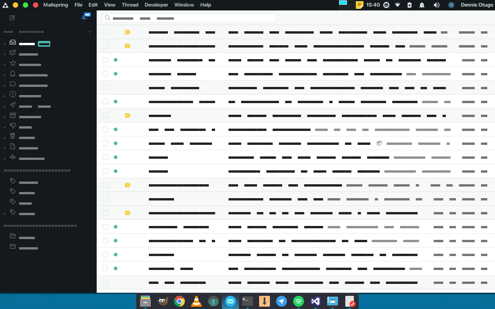
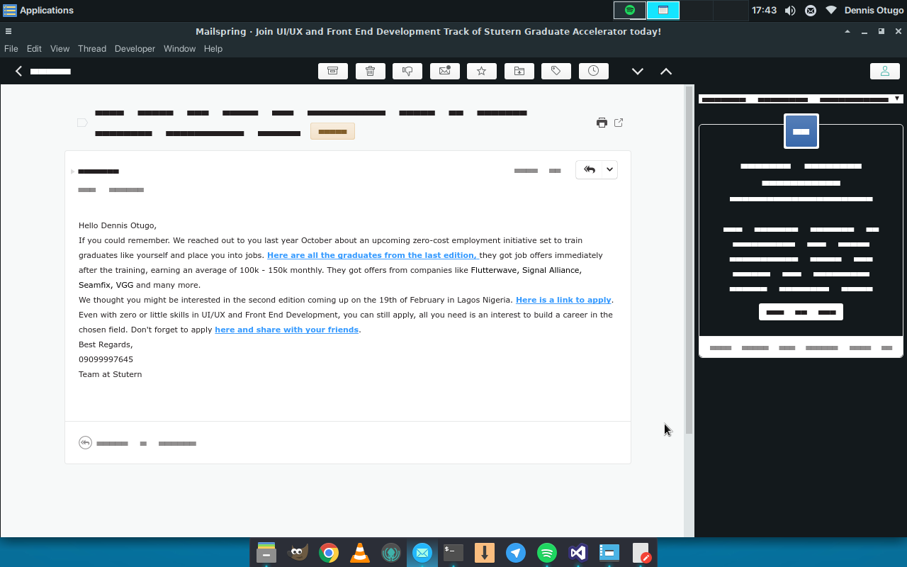

# Mailspring Adapta Theme

Adapta Dark theme for mail client [Mailspring](https://github.com/Foundry376/Mailspring)





# Install
Download [ZIP-Archive](https://codeload.github.com/bananas-and-trees/Mailspring-Adapta-Theme/zip/master) and extract. Run Mailspring, select **Edit - Install Theme...** and choose folder.

# For KDE
```
sed -i 's|2F343F|383C4A|g' ~/.config/Mailspring/packages/adapta/styles/ui-variables.less
```
